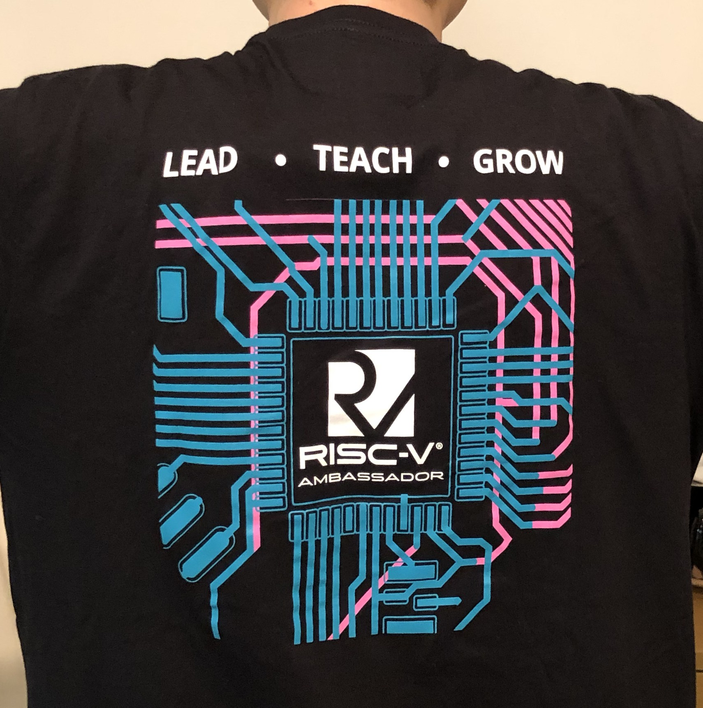
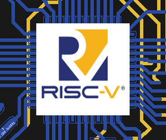
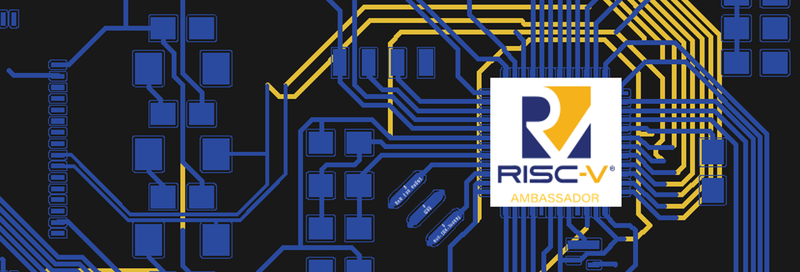
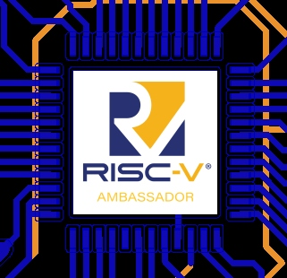
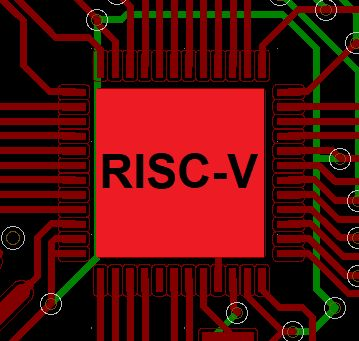

# RISC-V T-Shirt logo

Data files for RISC-V Ambassador logos used for creating T-Shirts and notebooks.

The first project used KiCad for designing T-Shirt logos.

The logo data is inspired by PCB layout of the real RISC-V board developed by SparkFun.

The T-Shirt.

## RISC-V Logs in Light Blue and Light Yellows.

## RISC-V Logs in Blue and Yellows.

## RISC-V Logs in Green and Pink.

## RISC-V Logs in Red and Green.

## RISC-V Ambassador logo data

Transparent background.

White background.

# Directory of all data.

## All image files

All image files are located under `images`.

[images](images/)

## Directory of KiCad data files.

The KiCad data was created by converting from original Eagle file format.

The project files and others of KiCad are located under ` SparkFun_REDV_RedBoard-kicad-logo-1`.

Links to the kicad data files.

[kicad](SparkFun_REDV_RedBoard-kicad-logo-1)

## Link to the SparkFun RED-V RedBoard.

https://www.sparkfun.com/products/15594
